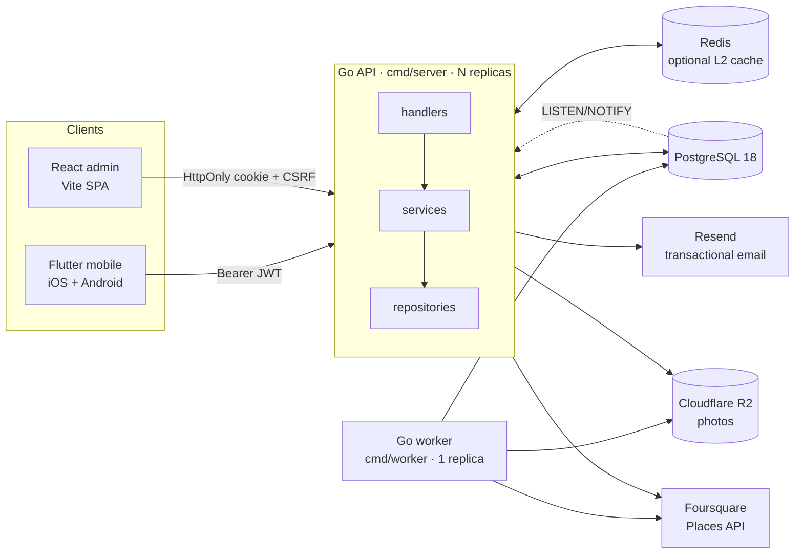
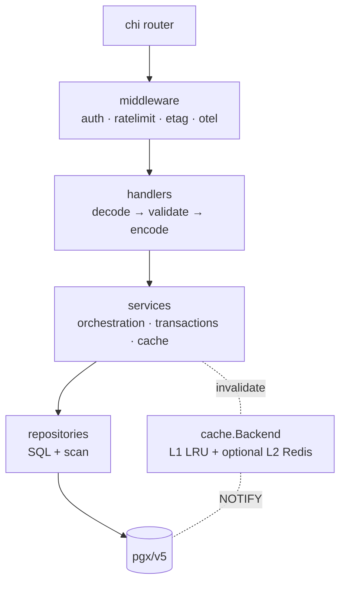
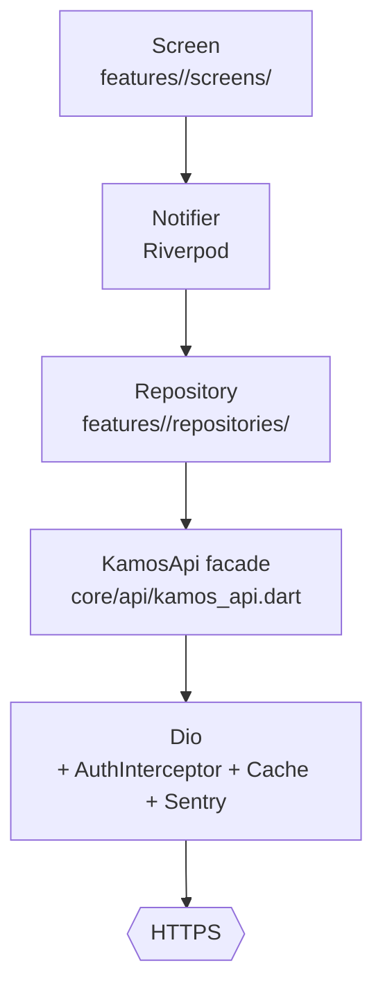

# KAMOS — Architecture

A one-pass orientation for engineers landing in the repo. For product behaviour, defer to `SPEC.md`. For environment + deploy, defer to `DEPLOYMENT.md`. For contribution mechanics, defer to `CONTRIBUTING.md`.

## 1. System overview

KAMOS is a discovery + check-in platform for Japanese alcoholic beverages — Untappd-shaped, EN/JA/KO from day one. The mobile app (Flutter, iOS + Android) is the primary end-user surface; a React admin web client handles taxonomy curation and moderation. Both speak the same Go REST API, backed by PostgreSQL 18 with optional Redis (multi-replica cache) and Cloudflare R2 (check-in photos). Foursquare Places provides optional venue tagging.

The API process is stateless and scales horizontally. The worker is single-replica and owns every scheduled job. Cross-replica cache invalidation rides on Postgres `LISTEN/NOTIFY`.

## 2. Backend layers

**Handler layer (`internal/handlers/`)** — HTTP decode/validate/encode only. Split into small per-aggregate files: `auth_credentials.go`, `auth_tokens.go`, `auth_account.go`, `admin_beverage_requests.go`, `admin_users.go`, `admin_comments.go`, `admin_checkins.go`, `admin_moderation_log.go`, and the per-resource bundles (`beverages.go`, `checkins.go`, `collections.go`, `comments.go`, `feed.go`, `search.go`, `social.go`, `users.go`, `venues.go`, `uploads.go`, `taxonomy.go`). The `Handler` struct is now a thin coordinator — services own the work.

**Service layer (`internal/service/`)** — `auth_service.go`, `checkin_service.go`, `comment_service.go`, `admin_service.go`, `social_service.go`. Each owns one aggregate's orchestration: multi-repo transactions, cache invalidation, and cross-replica `NOTIFY` emission. Services take small repository interfaces, never the god-bundle — the dependency direction stops at the service boundary, so tests can substitute repo fakes without rebuilding the world.

**Repository layer (`internal/repository/`)** — Pure SQL + scan. No business logic. Uses denormalized counters (`toast_count`, `comment_count`, `beverage_count`, `entry_count`) maintained by trigger functions in migration `011_counter_caches.sql`. Cursor pagination uses tuple keysets (e.g. `(created_at, id) < (?, ?)`) with `pgcrypto`-friendly UUID comparison rather than correlated subqueries.

**Cross-cutting** —
- `internal/domain/` — typed request/response structs + `validate.SanitizeText` (rejects control chars + bidi-override; enforces UTF-8 length).
- `internal/httperr/` — `Render(err)` maps domain errors to HTTP responses; consolidated error code vocabulary.
- `internal/cursor/` — HMAC-signed (SHA-256) opaque cursor envelopes; signed with `CURSOR_SECRET`. Cursor rotation invalidates outstanding pages, never user sessions.
- `internal/cache/` — `Backend` interface (`InProcess` LRU + optional `Redis` adapter); `notify` invalidator fans out via Postgres `LISTEN`.
- `internal/observability/` — Sentry + OTel + Prometheus, all opt-in by env.

## 3. Flutter layers

**Feature folders (`lib/features/<feature>/`)** — Each aggregate (`feed`, `check_in`, `collections`, `comments`, `profile`, `social`, `discover`, `beverages`, `breweries`, `venues`, `auth`, `search`, `beverage_requests`) owns its screens, providers, and repositories. No cross-feature reach-throughs; shared widgets live in `lib/shared/widgets/`.

**Typed API facade (`lib/core/api/kamos_api.dart`)** — Single source of truth for every `/v1/...` path the app speaks. `ApiPaths` holds the constants; per-tag sub-facades (`facade.auth`, `facade.feed`, `facade.checkins`, etc.) own the typed methods. A backend rename is a one-line change here. Hand-written rather than codegen — `openapi_generator` on pub.dev pins an `analyzer` range that conflicts with the project's `build_runner`. The hand-written facade tracks `openapi.yaml` 1:1 and is small enough (~44 methods) to maintain.

**Consolidated exceptions (`lib/core/api/api_exceptions.dart`)** — `KamosApiException.fromDio(e)` flattens `DioException` into a typed family (`UnauthorizedException`, `ForbiddenException`, `NotFoundException`, `RateLimitedException`, `ServerException`, etc.). Repositories catch typed exceptions, never raw `DioException`.

**Shared widgets (`lib/shared/widgets/`)** — `AsyncWidget<T>` wraps the canonical `AsyncValue.when` pattern with a localized error string and standard spinner. `KamosCard`, `KamosChip`, `KamosLabel`, `KamosAvatar`, `StarsDisplay`, `StarsInput`, `KamosTabBar`, `KanpaiButton` are the design-system primitives.

**Theme + tokens (`lib/app/theme.dart`)** — `KamosTokens` (color/typography/radius/motion) and `KamosSpacing` (`xs/sm/md/lg/xl/xxl` = 4/8/12/16/24/32 px). Tokens flow from `design/tokens.json` → admin TS sink (`admin/src/lib/tokens.ts`) via `scripts/gen-tokens.sh`; CSS + Flutter sinks are currently hand-mirrored (codegen target queued, see CONTRIBUTING.md "Design tokens").

## 4. Multi-replica readiness

The API process is stateless and lock-free: no in-process scheduler, no per-replica counters, no sticky sessions. N replicas behind a load balancer is the supported topology. Background jobs (`internal/jobs/`: `username_hold`, `avg_rating_sweep`, `email_verification_cleanup`, `photo_orphan_cleanup`) live in the worker process at `cmd/worker/`. The worker stays single-replica by convention so each job ticks exactly once per interval.

**Belt-and-suspenders against misconfigured deploys** — the scheduler wraps every tick in `pg_try_advisory_lock`. If a stray API replica still tried to run jobs (e.g. an old image), only the first to grab the advisory lock would execute the body. Job correctness does not depend on operator discipline alone.

**Cache topology** — L1 is a per-replica LRU (`internal/cache/inprocess.go`). L2 is optional Redis (`internal/cache/redis.go`), enabled by `CACHE_BACKEND=redis` + `CACHE_REDIS_URL`. Cross-replica invalidation rides on Postgres `LISTEN/NOTIFY` over channel `kamos_cache_invalidate` (`internal/cache/notify.go`, `internal/cache/invalidator.go`) — every replica subscribes; mutators emit `NOTIFY` keyed by aggregate (e.g. `taxonomy`, `beverage:<id>`, `user:<id>`). The eventual-consistency window is in the low 100s of milliseconds nominal.

## 5. Auth topology

**Mobile (Flutter)** — Bearer JWT via `Authorization: Bearer …` header. Access tokens are short-lived (`JWT_TTL`, default 15m); refresh tokens are long-lived but revocable (`REFRESH_TTL`, default 30d) and rotate atomically inside a single Postgres transaction on every `POST /v1/auth/refresh`, with family revocation on detected reuse. JWT + refresh-token live in `flutter_secure_storage` per SPEC §6.9; iOS Keychain accessibility is `first_unlock_this_device` (post-Stage 0 hotfix), Android uses `EncryptedSharedPreferences`.

**Admin (React)** — `HttpOnly` + `Secure` + `SameSite=Strict` cookies for access + refresh, so the browser never exposes the token to JavaScript. CSRF protection uses a double-submit token: `X-CSRF-Token` request header is compared (constant-time) against the `kamos_admin_csrf` cookie value on every mutating request. All admin mutations require the header.

**SEC-006 soft-delete cache** — when a user is soft-deleted, their tokens must stop validating immediately for the full 30-day username-hold window. `internal/auth/` keeps an in-process LRU of soft-deleted user IDs (replenished from Postgres on miss); token verification rejects on hit. This avoids a per-request DB roundtrip while still honouring the SPEC invariant.

**Cursor signing** — every paginated response embeds an opaque cursor signed with `CURSOR_SECRET` (HMAC-SHA-256, ≥32-byte secret enforced at startup in production). Cursor rotation invalidates outstanding pages — clients re-paginate from page 1 — but does not log users out.

## 6. Library / framework choices

Short ADR-style rationale for the non-obvious picks:

- **`chi` (not Gin / Echo)** — preserves the standard `net/http` `Handler` / `ResponseWriter` shape, has minimal middleware overhead, and reads like idiomatic Go. Sub-router composition (`r.Route("/v1/users", ...)`) maps cleanly onto the per-aggregate handler files.

- **`pgx/v5` direct (no ORM)** — every query in this codebase is explicit SQL. The performance pack (Stage 5) relied on tuple keysets, denormalized counters, and trigger-maintained aggregates; that kind of work is awkward through an ORM but trivial in raw SQL with `pgx.Rows.Scan` helpers.

- **`Riverpod` (not Provider / BLoC)** — codegen-free with `flutter_riverpod`'s newer API, type-safe with `AsyncNotifier<T>`, `autoDispose` by default (less manual lifetime management). Played well with the per-feature folder layout.

- **`go_router` (not Navigator 2.0 raw)** — declarative route table + a single `redirect` callback that owns the auth gate. Deeplink-friendly. The hand-rolled Navigator 2.0 alternative was tried in spike and rejected as boilerplate-heavy.

- **`dio_cache_interceptor` (not custom)** — ETag round-trips + `Cache-Control` respect + per-request `forceRefresh` overrides came free. Custom interceptors would have re-implemented the same RFC subset.

- **`openapi.yaml` as the contract** — drives the admin TypeScript client (`openapi-fetch`), drives the hand-written Flutter `KamosApi` facade, and drives a Go test (`TestOpenAPIRouterParity`) that asserts every `operationId` corresponds to a registered route. Drift between layers is caught at CI time.

## 7. Observability

Three vendors, all opt-in by env. Empty value = SDK never initializes, no degraded behavior.

- **Sentry** — `kamos-api` project (Go) + `kamos-app` project (Flutter). Backend forwards panics + tagged release per `APP_VERSION`. Flutter forwards uncaught Dart errors; breadcrumb redactor strips auth tokens and PII (Stage 0).
- **OTel** — traces + metrics over OTLP/HTTP from both the API and the worker. Exporter endpoint + headers come from `OTEL_EXPORTER_OTLP_ENDPOINT` / `OTEL_EXPORTER_OTLP_HEADERS`. Prometheus `/metrics` is always-on locally.
- **Grafana Cloud** — stack `kamos` (ap-northeast-0) hosts dashboards + alerts. Dashboard panels for cache hit rate / request latency are pinned at `docs/history/qa/qa_phase7_grafana_panel.json`.

Cross-process correlation uses the standard W3C trace headers.

---

**Pointers**

- Product: `SPEC.md`
- Deploy + env vars: `DEPLOYMENT.md`
- Contribution mechanics: `CONTRIBUTING.md`
- Runbooks: `docs/runbooks/`
- Schema, indexes, query patterns: `docs/db/`
- Per-phase QA + review history: `docs/history/`
